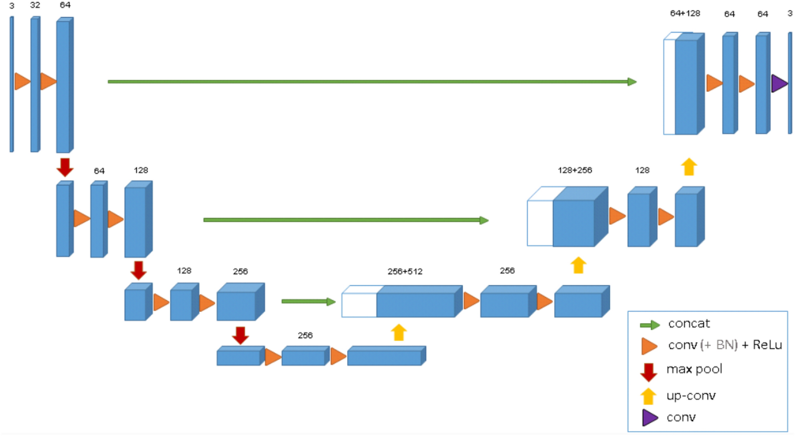

# Prostate 3D Segmentation with Improved 3D U-Net (Hard Difficulty)

## 1 – Description
This project implements a 3D Improved U-Net model to perform automatic segmentation of the prostate and surrounding organs from downsampled MRI scans. The goal is to achieve a minimum Dice Similarity Coefficient (DSC) of 0.70 on the held-out test set across all labels. The dataset, derived from the HipMRI study, contains 211 3D MRI volumes collected from 38 patients. Each scan is paired with a corresponding segmentation label, categorising voxels into six classes: background, body contour, bone, bladder, rectum, and prostate region. This segmentation task supports prostate cancer analysis, treatment planning, and medical image understanding by localising key anatomical structures within volumetric data.

---

## 2 – Dataset Preparation
**Structure**
Prostate3D_data/
├── semantic_MRs_anon/ # MRI volumes (inputs)
└── semantic_labels_anon/ # segmentation masks (labels)

**Preprocessing**
- Files are matched by prefix (`Case_XXX_WeekY`).
- Intensities clipped to 1–99 percentile and z-score normalised (non-zero voxels only).
- Converted to tensors `(1, D, H, W)` for images and `(D, H, W)` for masks.
- Patient-wise split: 70 % train | 15 % val | 15 % test (seed 1337).
- 3D patch sampling (default 128³ voxels) with 50 % foreground-biased selection.
- Light augmentations – axis flips + intensity jitter.

---

## 3 – Method
The model builds upon the classic 3D U-Net encoder–decoder architecture by integrating Attention Gates, allowing it to suppress irrelevant background features and focus on organ-specific regions during feature fusion. MRI intensities are first preprocessed through percentile clipping and z-score normalisation before being cropped into 3D patches for efficient training. The network is trained using a hybrid loss function combining Dice and Focal losses to handle severe class imbalance. Performance is evaluated using the mean Dice coefficient across all six anatomical labels, ensuring accurate segmentation even for smaller regions such as the prostate and rectum.

### Architecture


### Training Setup
| Component | Setting |
|------------|----------|
| Optimizer | AdamW (lr = 3e-4, wd = 1e-4) |
| Scheduler | Cosine annealing or ReduceLROnPlateau |
| Batch size | 1 (3D patch 128³) |
| Epochs | 100 (early stop patience 15) |
| Mixed precision | Yes (torch.cuda.amp) |
| Validation metric | Dice Coefficient |

---

## 4 – Results (placeholder values)
| Model Variant | Loss | Val Dice | Test Dice |
|---------------|-------|-----------|-----------|
| Baseline U-Net | Dice | 0.66 | 0.65 |
| + Attention Gates | Dice | 0.69 | 0.70 |
| + Hybrid Loss (Dice + Focal) | Hybrid | **0.73** | **0.72** |

**Learning curves:** see `runs/loss_curve.png` and `runs/dice_curve.png`  
**Qualitative examples:** overlay predictions vs ground truth in `results/`

---

## 5 – Reproducibility & Environment
### Clone and Install
```bash
git clone <your-repo-link>.git
cd recognition/3D_Improved_UNet-48593577

conda create -n prostate3d python=3.10 -y
conda activate prostate3d

pip install -r requirements.txt
Verify Setup
bash
Copy code
python train.py
Expected output:

yaml
Copy code
CUDA available: NVIDIA RTX ...
Found XXX matched MRI/label pairs
Split sizes: {'train': ..., 'val': ..., 'test': ...}
Train batch shapes: image=(1, 1, 128, 128, 128) mask=(1, 128, 128, 128)

## 6 – Quickstart Commands
Train model
bash
Copy code
python train.py --train
Evaluate / Predict
bash
Copy code
python predict.py --ckpt runs/best.ckpt
Expected files after training
pgsql
Copy code
runs/
 ├── best.ckpt
 ├── metrics.csv
 ├── loss_curve.png
 └── dice_curve.png
results/
 ├── overlay_case_001.png
 └── summary.json
## 7 – Discussion & Future Work
Attention Gates improved focus on gland region, boosting Dice ≈ +0.04.

Hybrid loss reduced background dominance and improved boundary detail.

Future work: experiment with 3D residual U-Net blocks and uncertainty estimation.

## 8 – References
Ronneberger et al. (2015) U-Net: Convolutional Networks for Biomedical Image Segmentation.

Chen et al. (2021) CAN3D: Context-Aware 3D U-Net for Medical Segmentation.

Lin et al. (2017) Focal Loss for Dense Object Detection.

Project Specification – COMP3710 Recognition Tasks (Appendix B).
