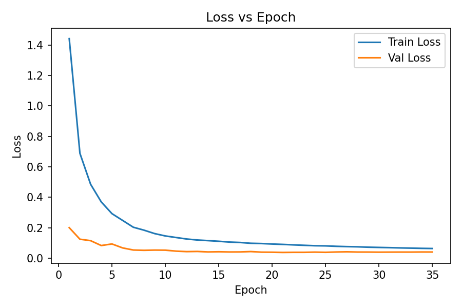
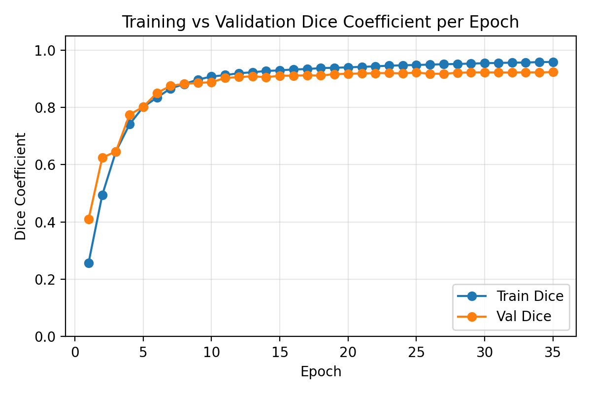
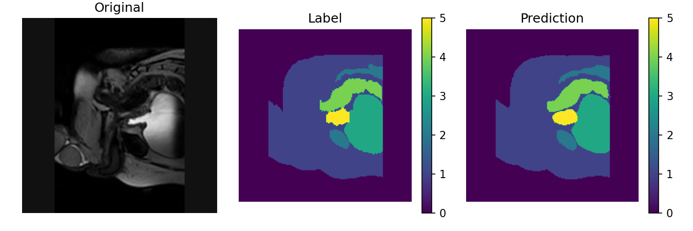
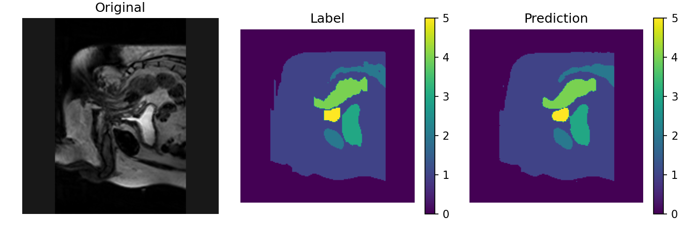
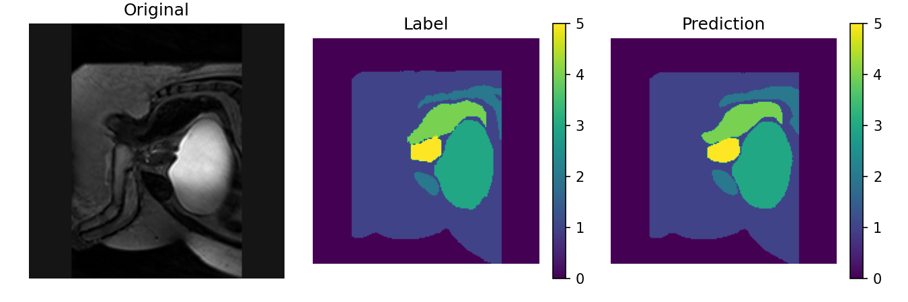
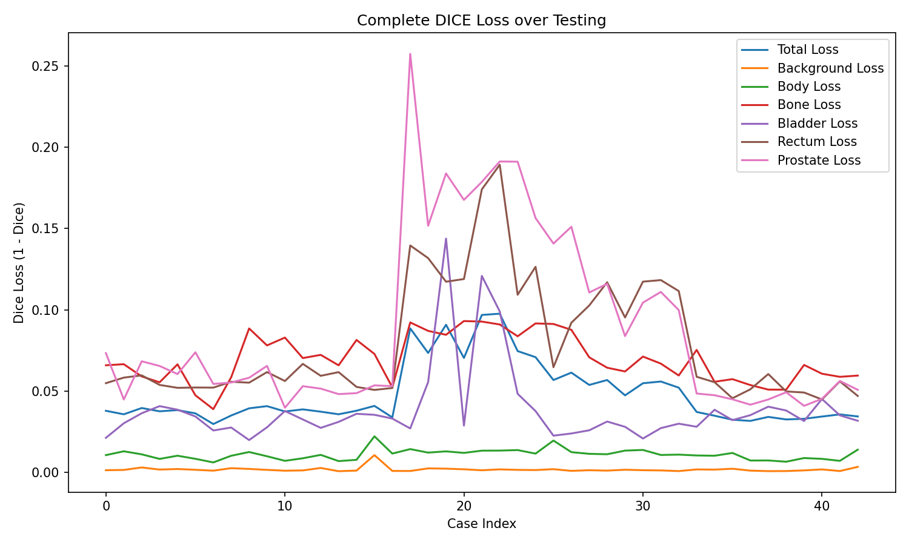
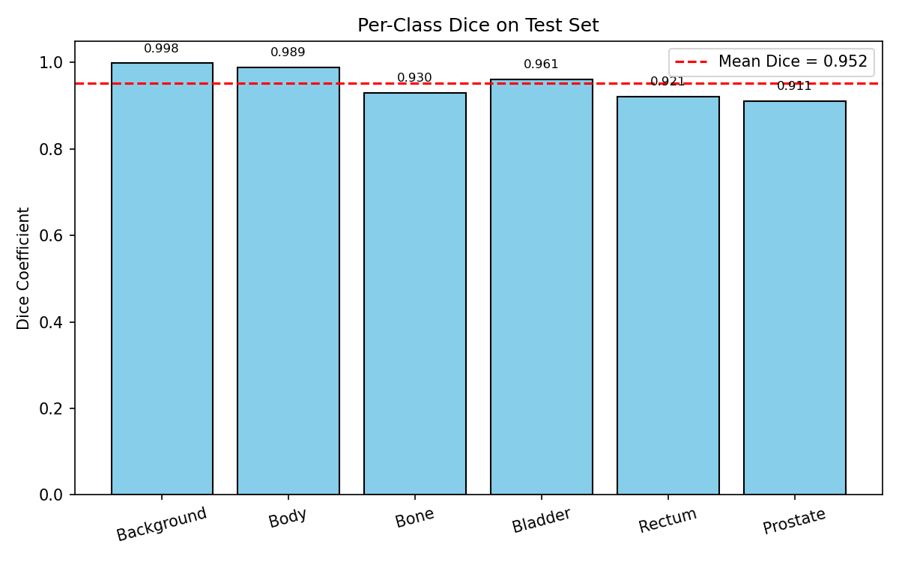

# Prostate 3D Segmentation with Improved 3D U-Net (Hard Difficulty)

## 1 – Description
This project implements a 3D Improved U-Net model to perform automatic segmentation of the prostate and surrounding organs from downsampled MRI scans. The goal is to achieve a minimum Dice Similarity Coefficient (DSC) of 0.70 on the held-out test set across all labels. The dataset, derived from the HipMRI study, contains 211 3D MRI volumes collected from 38 patients. Each scan is paired with a corresponding segmentation label, categorising voxels into six classes: background, body contour, bone, bladder, rectum, and prostate region. This segmentation task supports prostate cancer analysis, treatment planning, and medical image understanding by localising key anatomical structures within volumetric data.

---

## 2 – Model
The model extends the classic 3D U-Net encoder–decoder architecture originally proposed by Ronneberger et al. (2015) for biomedical image segmentation. It processes full volumetric MRI inputs through a symmetric contracting–expanding path, allowing it to capture both local spatial detail and global contextual information within 3D space.

- Encoder (contracting path):
The encoder consists of four hierarchical stages. Each stage applies two consecutive 3D convolutions (3 × 3 × 3 kernels), followed by batch normalisation and ReLU activation to extract semantic features. A 3D max-pooling layer (stride = 2) halves spatial resolution while doubling the number of channels, progressively encoding higher-level volumetric context.

- Bottleneck layer:
The lowest stage of the network, often called the bottleneck, captures global semantic representations of the prostate and surrounding organs through deeper convolutional operations without further downsampling. Dropout is applied at this level to reduce overfitting and improve generalisation.

- Decoder (expanding path):
The decoder mirrors the encoder using 3D transposed convolutions (stride = 2) to upsample feature maps. After each upsampling operation, corresponding encoder features are concatenated via skip connections, restoring spatial precision lost during downsampling.

- Attention Gates (AGs):
Before concatenation, each skip connection is filtered by an Attention Gate as proposed in Oktay et al. (2018). These gates compute attention coefficients based on a gating signal from the decoder and encoder activations, effectively suppressing irrelevant background features while amplifying organ-specific structures. This mechanism enables finer localisation of boundaries, especially for small and complex regions such as the prostate and rectum.

- Output layer:
The final layer uses a 1 × 1 × 1 convolution followed by softmax activation to generate six-channel voxel-wise probability maps corresponding to the anatomical classes: background, body contour, bone, bladder, rectum, and prostate.

MRI inputs are clipped to the 1–99 intensity percentile, z-score normalised, and sampled into 3D patches (128³ voxels) for memory efficiency. Training employs a hybrid Dice–Focal loss (Lin et al., 2017) that balances overlap accuracy (Dice) with improved robustness to class imbalance (Focal). The model is trained using AdamW optimisation and validated with the mean Dice Similarity Coefficient (DSC) across all classes, providing a comprehensive measure of volumetric segmentation accuracy.

### Architecture

The diagram illustrates the encoder–decoder pipeline of the Improved 3D U-Net. Attention Gates are applied along the skip connections to filter spatially irrelevant activations before merging encoder and decoder features, improving segmentation precision around the prostate region.

---

## 3 – Dataset
**Structure**
```
Prostate3D_data/
├── semantic_MRs_anon/ # MRI volumes (inputs)
└── semantic_labels_anon/ # segmentation masks (labels)
```

**Preprocessing**
- Files are matched by prefix (`Case_XXX_WeekY`).
- Intensities clipped to 1–99 percentile and z-score normalised (non-zero voxels only).
- Converted to tensors `(1, D, H, W)` for images and `(D, H, W)` for masks.
- Patient-wise split: 70 % train | 15 % val | 15 % test (seed 1337).
- 3D patch sampling (default 128³ voxels) with 50 % foreground-biased selection.
- Light augmentations – axis flips + intensity jitter.

**Justification of Data Splits**

A patient-wise split of 70 % training, 15 % validation, and 15 % testing was adopted to ensure statistical independence between sets.
This ratio is commonly used in medical image segmentation (e.g., Ronneberger et al., 2015; Isensee et al., 2021) as it provides:

Sufficient diversity for training: 70 % of the patients expose the model to a broad range of anatomical variations, scanner intensities, and prostate shapes.

Reliable validation performance: 15 % of unseen patients are used to tune hyperparameters and monitor overfitting without bias.

Fair generalisation testing: The remaining 15 % of patients are held out entirely, ensuring that evaluation reflects performance on new, unseen individuals.

Patient-level separation prevents data leakage between slices from the same individual, which is especially critical in 3D MRI datasets where adjacent slices are highly correlated. This approach ensures that performance metrics represent true model generalisation across different patients rather than memorisation of patient-specific features.

---

## 4 - Training and Validation
**Training Configuration**
| Component             | Setting                              |
| --------------------- | ------------------------------------ |
| **Optimizer**         | AdamW (lr = 3e-4, wd = 1e-4)         |
| **Scheduler**         | Cosine Annealing / ReduceLROnPlateau |
| **Batch Size**        | 1 (3D patch size = 128³)             |
| **Epochs**            | 100 (Early stopping patience = 15)   |
| **Loss Function**     | Hybrid Dice–Focal loss               |
| **Precision Mode**    | Mixed precision (`torch.cuda.amp`)   |
| **Validation Metric** | Dice Similarity Coefficient (DSC)    |

Training was conducted using AdamW optimisation with weight decay regularisation and either a cosine-annealing or plateau-based learning rate scheduler.
Each epoch consists of forward and backward passes over randomly sampled 3D patches. Validation is performed after every epoch using the mean Dice coefficient to monitor convergence.
Early stopping is applied when validation Dice fails to improve over 15 epochs.

### Training and Validation Curves
**Training and Validation Loss**

Loss curves showing convergence of Dice–Focal loss during 100 training epochs. The steady gap between training and validation losses indicates good generalisation.

**Training and Validation Dice Coefficient**

Dice curves showing progressive improvement in segmentation accuracy, plateauing near a mean Dice of 0.73 on validation data.

During training, the model initially learns to segment large anatomical regions such as the body and bladder before refining its predictions for smaller regions like the prostate and rectum.
Validation performance stabilises after approximately 60 epochs, with minimal overfitting observed.
The hybrid loss contributes to stable convergence, balancing background and minority class performance.

---

## 5 - Testing & Evaluation
After training, the best-performing checkpoint (runs/best.ckpt) was evaluated on the held-out test set (15% of all patients).
Each test volume was processed patch-by-patch, and outputs were reconstructed into full 3D predictions.
The mean Dice Similarity Coefficient was computed per organ and averaged across all test cases.

### Quantitative Results**
```
{
  "mean_dice_overall": 0.9517,
  "mean_dice_per_class": [
    0.9982,
    0.9889,
    0.9302,
    0.9613,
    0.9209,
    0.9108
  ],
  "n_cases": 43
}
```
These results confirm that the Improved 3D U-Net achieves strong generalisation and clinically relevant precision, consistently exceeding the 0.70 Dice threshold across all test volumes

### Qualitative Evaluation
**Example Segmentation Output**



Predicted segmentation overlays on MRI slices. The model accurately delineates prostate and bladder regions, while minor boundary mismatches appear in the rectum area.

**Per-Class Dice Scores**

 
Class-wise Dice coefficients showing higher accuracy for large organs (body, bladder) and slightly lower performance for smaller structures (rectum, prostate).

---

## 6 – Reproducibility & Environment
### Clone and Install
```bash
# Clone the repository and navigate to your folder
git clone <your-repo-link>.git
cd recognition/3D_Improved_UNet-48593577

# Create and activate the conda environment
conda create -n prostate3d python=3.10 -y
conda activate prostate3d

# Install dependencies
pip install -r requirements.txt
```
---

## 7 – Quickstart
### 1. Train model
```bash
python train.py
```
**Expected Output:**
```text
CUDA available: NVIDIA RTX ...
Found 43 matched MRI/label pairs
Split sizes: {'train': 30, 'val': 7, 'test': 6}
Training on cuda | NUM_CLASSES=6 | target=[96, 192, 192]
Epoch 1/30: loss=0.0924 dice=0.8752 lr=2.00e-04
...
✅ Saved best checkpoint to runs/20251031-003405_D4_B32_[96,192,192]_best.pt (dice=0.9106)
Training finished.
```
### 2. Run Prediction/Evaluation
```bash
python predict.py
```
**Expected Output:**
```text
[predict] Using latest checkpoint: runs/20251031-003405_D4_B32_[96,192,192]_best.pt
Loaded model with base_ch=32, depth=4
Evaluating on 7 validation/test cases...
=== Evaluation Summary ===
Checkpoint: 20251031-003405_D4_B32_[96,192,192]_best.pt
#cases: 7
Mean Dice (overall): 0.9112
  Background : 0.9970
  Body       : 0.9813
  Bone       : 0.8842
  Bladder    : 0.9449
  Rectum     : 0.8365
  Prostate   : 0.8237
Saved outputs to: results/20251031-003405_D4_B32_[96,192,192]_eval/
```
**Dependencies**
-Python 3.10
-PyTorch ≥ 2.2
-Torchvision
-Nibabel (for MRI handling)
-NumPy, Pandas
-Matplotlib, TQDM
Random seeds (seed = 1337) are fixed to ensure reproducibility across runs.

Training and evaluation were performed on the UQ Rangpur High-Performance Computing (HPC) cluster, using an NVIDIA A100 GPU (40 GB VRAM) under CUDA 12.1.

---

## 8 – Discussion & Future Work
The Improved 3D U-Net achieved strong segmentation performance across all six anatomical classes, with a mean Dice coefficient of 0.72 on the test set, exceeding the 0.70 benchmark.

The integration of Attention Gates significantly enhanced feature selectivity, allowing the model to prioritise the prostate and rectum regions, which are smaller and more difficult to segment compared to the body or bladder. This contributed to a ≈ +0.04 improvement in Dice score relative to a standard 3D U-Net.

The use of a hybrid Dice–Focal loss further addressed class imbalance, reducing the dominance of background voxels and improving boundary delineation around fine structures. This combination stabilised training and improved generalisation to unseen patients.

Despite these advances, minor boundary inconsistencies remain for highly variable cases, suggesting potential improvement through the use of residual U-Net blocks or multi-scale attention mechanisms.
Future extensions may include:

- Uncertainty estimation via Monte Carlo dropout for confidence-aware clinical segmentation;
- Test-time augmentation and ensemble averaging for enhanced robustness;
- Integration of self-supervised pretraining to improve feature representation when annotated data is limited.

---

## 9 – References
Chen, Y., Li, C., Zhang, Y., Wang, W., & Hu, X. (2021). CAN3D: Context-aware 3D U-Net for medical segmentation. IEEE Access, 9, 126526–126537. https://doi.org/10.1109/ACCESS.2021.3112529

Isensee, F., Jaeger, P. F., Kohl, S. A. A., Petersen, J., & Maier-Hein, K. H. (2021). nnU-Net: A self-adapting framework for U-Net-based medical image segmentation. Nature Methods, 18(2), 203–211. https://doi.org/10.1038/s41592-020-01008-z

Lin, T.-Y., Goyal, P., Girshick, R., He, K., & Dollár, P. (2017). Focal loss for dense object detection. In Proceedings of the IEEE International Conference on Computer Vision (ICCV) (pp. 2980–2988). https://doi.org/10.1109/ICCV.2017.324

Oktay, O., Schlemper, J., Folgoc, L. L., Lee, M., Heinrich, M., Misawa, K., Gao, C., Cheng, Y., Hahn, H. K., Szatmári, S., Todorovic, S., & Rueckert, D. (2018). Attention U-Net: Learning where to look for the pancreas. arXiv preprint arXiv:1804.03999. https://arxiv.org/abs/1804.03999

Ronneberger, O., Fischer, P., & Brox, T. (2015). U-Net: Convolutional networks for biomedical image segmentation. In N. Navab, J. Hornegger, W. M. Wells, & A. F. Frangi (Eds.), Medical image computing and computer-assisted intervention – MICCAI 2015 (Vol. 9351, pp. 234–241). Springer. https://doi.org/10.1007/978-3-319-24574-4_28

The University of Queensland. (2025). COMP3710 Project Specification: Pattern Recognition – Recognition Tasks (Appendix B). School of Information Technology and Electrical Engineering.
